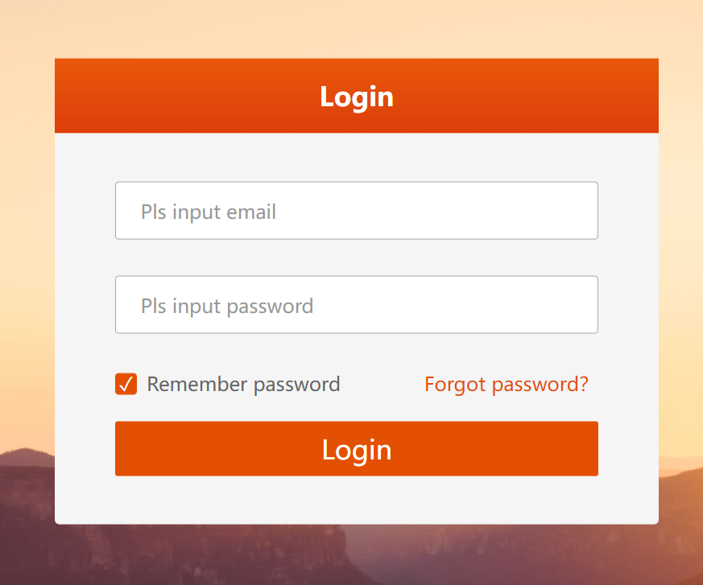
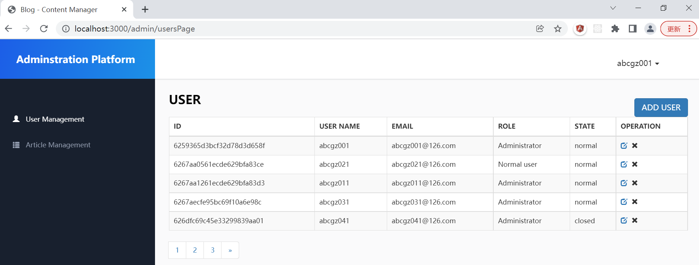
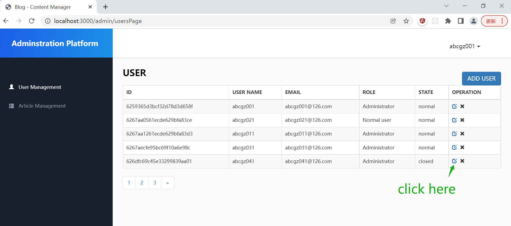
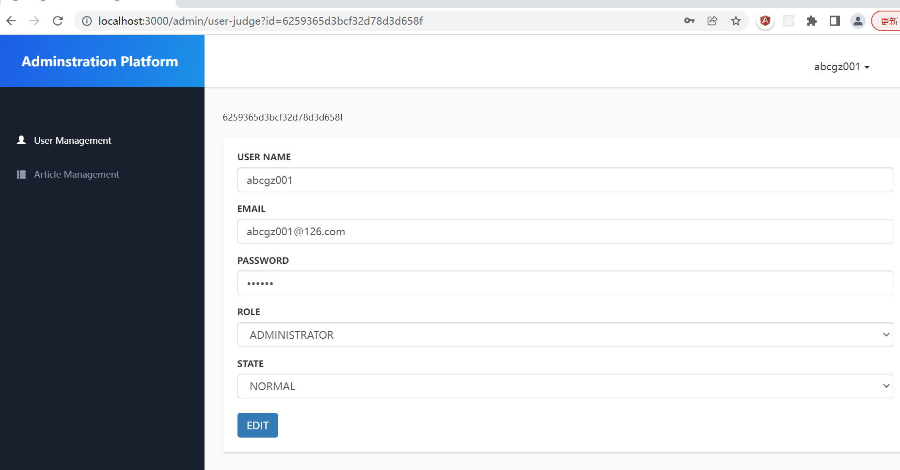
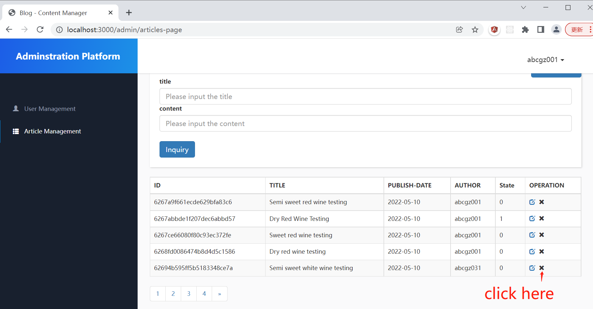
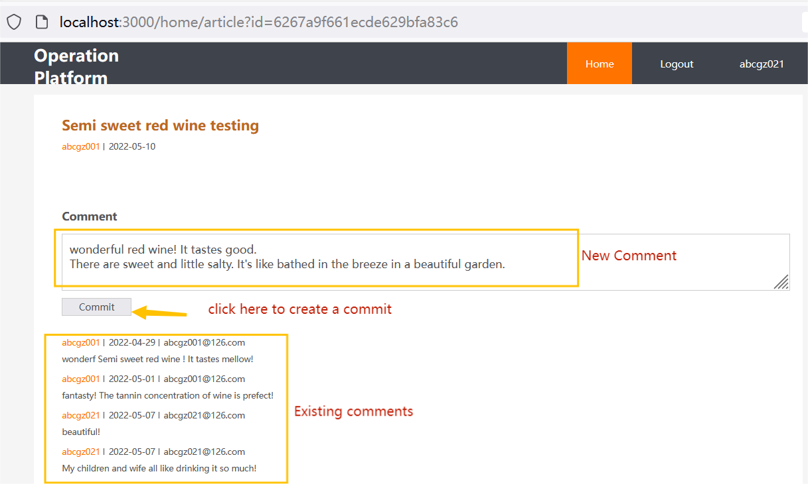

Catalogue

```

1.Introduction（a blog for Canadian wine users）

2. Testing of the adminstration platform

3. Testing the operation platform

4. Initialization and configuration 

  4.1 Initialization

  4.2 Platform Routing

  4.3 Configure management

  4.4 Middle ware of interceptor

  4.5 Authentication 

  4.6 Error handling

4. Scheme of the Data

  4.1 User

  4.2 Article

  4.3 comment

5. Coding of adminstration platform

  5.1 User management

      5.1.1 the related routers about the user management    

      5.1.2 login

      5.1.3 Logout

      5.1.4 List all users in pagination

      5.1.5 Create a user

      5.1.6 Modify a user

      5.1.7 Delete a user

  5.2 Article management

      5.2.1 Routers about the article management

      5.2.2 List all articles in pagination

      5.2.3 Create an article

      5.2.4 Modify an article

      5.2.5 Delete an article

6. Coding of operation platform

  6.1 Routing in operation platform

  6.2 Comment management

       6.2.1 Comment management related routeres 

       6.2.2 model of commet collection 

     6.2.3 List detail of one article and all related comments.

       6.2.4 Create a comment

7. Testing the administration platform

  7.1 User management

       7.1.1 Login

       7.1.2 List all users in pagination

       7.1.3 Modify a user

  7.2 Article management

       7.2.1 List all articles in pagination

8. Testing the operation platform

  8.1 Article management

       8.1.1 List all articles in pagination

  8.2 Create a comment

9. Tools used

  9.1 Session control

  9.2 template

  9.3 Password encryption processing

  9.4 Formidable

10、Nginx and the load balance
```
 

 


# 1.  Introduction（a blog for Canadian wine users）

This blog has 2 platforms. One is adminstration platform, the user should login to have the approval to manage the articles and users. 

Another one is operation platform. It is free to browse all articles listed but the user should login if he/she want to write down the comments about the articles.

## 1.1 The adminstration platform has these features :

List all articles which were consisted by picture of different wines and related text descriptions.

Manage(create, query , modify and delete) these articles by authentication.

Manage(create, query , modify and delete) the users by authentication.


## 1.2 The operation platform has these features:

List all articles which were consisted by picture of different wines and related text descriptions.

List detail of one articles and all related comments.

The user can write down his/her comments about one article if he/she has login the system.


# 2. Testing of the adminstration platform

## 2.1 User management

### 2.1.1 Login


### 2.1.2 List all users in pagination



### 2.1.3 Modify a user

    
	


 

## 2.2 Article management

### 2.2.1 List all articles in pagination
.png)


### 2.2.2 Delete an article


 

# 3. Testing the operation platform

## 3.1 Article management

### 3.1.1 List all articles in pagination
.png)

 


 

## 3.2 Create a comment


 


# 2. UI design

## 2.1 adminstration platform

2.1.1 User management

A. List all users in pagination

 


B. Create a user

 


2.1.2 Artcile management


A. List all articles in pagination


## 2.2 Operation platform

2.2.1 Article management

A. List all Articles in pagination


2.2.2 Comments management

A. submit a comment

 


 

# 3. Initialization and configuration 

 

## 3.1 Initialization

3.1.1 Initialization the project

```
  npm init -y
```

3.1.2 Install the folders for the project
```
public  - static resources

model - database

route -routing

views-template
```


 

3.1.3 Download third party modules required for the project
```
   npm install express mongoose art-template express-art-template
``` 

3.1.4 Install the server

        Here list the related codes in ./app.js
```
// Reference the express framework
   const express = require('express');
   // install the server 
   const app = express();
   // listen the port
   app.listen(3000);
   console.log('The server successfully startup, please visit : localhost:3000')
``` 

3.1.5 Setup the blog management template:

Here list the related codes in ./app.js
```

   // the folder of the view

   app.set('views', path.join(__dirname, 'views'));

   // Default suffix of frame template

   app.set('view engine', 'art');

   // the template engine

   app.engine('art', require('express-art-template'));

   //path of static resource

   app.use(express.static(path.join(__dirname, 'public')))
``` 

## 3.2 Platform Routing

Here list the related codes in ./app.js
```
   // reference the routing

   const home = require('./route/home');

   const admin = require('./route/admin');

   // Match request path using routing

   app.use('/home', home);

   app.use('/admin', admin);
```


## 3.3 Configure management

3.3.1 Connecting MongoDB
```
Here list the related  codes  in ./app.js

// reference the mongoose

const mongoose = require('mongoose');

// connect the MongoDB

mongoose.connect('mongodb://192.168.121.134:27017/blog', {useNewUrlParser: true })

.then(() => console.log('successfully connect the MongoDB'))

.catch(() => console.log('failed connect the MongoDB'))
```

## 3.4 Middle ware of interceptor

In ./middleware/loginGuard.js, create the login interceptors:
```
//If the user is not logged in, redirect the request to the login page

app.use('/admin', (req, res, next) => {

if (req.url != '/login' && !req.session.username) {

res.redirect('/admin/login');

} else {

next();

}

});

```


## 3.5 Authentication 

in ./app.js
```
// intercept all requests with authentication if the path is admin
app.use('/admin', require('./middleware/loginGuard'));
```


## 3.6 Error handling

Here list the related code in ./app.js
```
app.use((err, req, res, next) => {

// parse the err string JSON object to an JS object

// JSON.parse()

const result = JSON.parse(err);

// { path: '/admin/user-judge', message: 'The email address has been occupied' }

let params = [];

for (let attr in result) {

if (attr != 'path') {

params.push(attr + '=' + result[attr]);

}

}

res.redirect(`${result.path}?${params.join('&')}`);

})
```


# 4. Scheme of the Data


## 4.1 User

In ./model/user.js, Create the user collection in MongoDB
```
// create the user collection in MongoDB

// reference the mongoose

const mongoose = require('mongoose');

// create the rule of user collection

const userSchema = new mongoose.Schema({

username: {

type: String,

required: true,

minlength: 2,

maxlength: 20

},

email: {

type: String,

// the email should be unique

unique: true,

required: true

},

password: {

type: String,

required: true

},

// admin : super administrator

// normal : normal administrator

role: {

type: String,

required: true

},

// 0 : on use

// 1 : Disabled

state: {

type: Number,

default: 0

},

hashed_password: {

    type: String


},

salt: {

    type: String

}


});

 

// create the User

const User = mongoose.model('User', userSchema);
module.exports = {
User
}
```

4.2 Article

create the  ./model/article.js :
```
// 1.introducing the mongoose module
const mongoose = require('mongoose');

// 2.create the  article schema
const articleSchema = new mongoose.Schema({
  title: {
    type: String,
    maxlength: 20,
    minlength: 0,
    required: [true, 'Pls input the title']
  },
  author: {
    type: mongoose.Schema.Types.ObjectId,
    ref: 'User',
    required: [true, 'Pls input the author']
  },
  publishDate: {
    type: Date,
    default: Date.now
  },
  cover: {
    type: String,
    default: null
  },
  content: {
    type: String
  },
  state: {
    type: String,
    default: '0'
  }
});

// 3. create the article collection according the schema
const Article = mongoose.model('Article', articleSchema);

// 4. export the module
module.exports = {
  Article
}
```

4.3 comment

create the  ./model/comment.js
```
// Intriducing the mongoose module
const mongoose = require('mongoose');

// creating the comment schema
const commentSchema = new mongoose.Schema({
  // article id
  aid: {
    type: mongoose.Schema.Types.ObjectId,
    ref: 'Article'
  },
  // user id
  uid: {
    type: mongoose.Schema.Types.ObjectId,
    ref: 'User'
  },
  // comment date
  time: {
    type: Date
  },
  // content of the comment
  content: {
    type: String
  }
});

// creating the comment collection 
const Comment = mongoose.model('Comment', commentSchema);

// export the comment module
module.exports = {
  Comment
}
```

# 5. Coding of adminstration platform

## 5.1 User management

 

5.1.1 the related routers about the user management

the related codes in ./controller/admin.js

// introducing the Express module
const express = require('express');
// the rounter of adminstration platform
const admin = express.Router();

// the login Page rounter
admin.get('/login', require('./admin/loginPage'));

// the login processing
admin.post('/login', require('./admin/user-query'));

// list all users in pagination
admin.get('/usersPage', require('./admin/usersPage'));

// logout
admin.get('/logout', require('./admin/logout'));

// judge whether to modify or create the user
admin.get('/user-judge', require('./admin/user-judge'));

// create a user
admin.post('/user-create', require('./admin/user-create'));

// modify a user
admin.post('/user-modify', require('./admin/user-modify'));

// delete a user
admin.get('/user-delete', require('./admin/user-delete'));


5.1.2 login

（a）Action


<!DOCTYPE html>
<html lang="en">

<head>
    <meta charset="UTF-8">
    <title>Login</title>
    <link rel="stylesheet" href="/admin/lib/bootstrap/css/bootstrap.min.css">
    <link rel="stylesheet" href="/admin/css/base.css">
    <!-- option -->
    <link rel="stylesheet" href="/admin/css/login.css">
</head>

<body>
    <div class="login-body">
        <div class="login-container">
            <h4 class="title">Login</h4>
            <div class="login">
                <form action="/admin/login" method="post" id="loginForm">
                    <div class="form-group">
                        <label>E-mail</label>
                        <input name="email" type="email" class="form-control" placeholder="Pls input email">
                    </div>
                    <div class="form-group">
                        <label>PASSWORD</label>
                        <input name="password" type="password" class="form-control" placeholder="Pls input password">
                    </div>
                    <div class="savepass">
                        <div class="savepass-check">Remember password</div>
                        <div class="savepass-a">Forgot password？</div>
                    </div>
                    <button type="submit" class="btn btn-primary">Login</button>
                </form>
            </div>
            <div class="tips"></div>
        </div>
    </div>
    <script src="/admin/lib/jquery/dist/jquery.min.js"></script>
    <script src="/admin/lib/bootstrap/js/bootstrap.min.js"></script>
    <script src="/admin/js/common.js"></script>
    <script type="text/javascript">
        // event for the submit the form
        $('#loginForm').on('submit', function () {
            // get the value of user input 
            var result = serializeToJson($(this))
            // if no email 
            if (result.email.trim().length == 0) {
                alert('Pls input the email');
                // return 
                return false;
            }
            // if no password
            if (result.password.trim().length == 0) {
                alert('PLS input the password')
                // return
                return false;
            }
        });
</script>
</body>
</html>


in Line 18th, setup the request address, request method and the input node attribution for the login Form.  in Line 40th-Line58th， setup the verification. 

（b）Controller

in ./admin/user-query.js, create the related codes to perform the user query processing and later store the user information into sesson. 

(1) receive the parameters from request;

(2) query the user information by using the e-mail

(3) Generate the corresponding hashed_password by using MD5 algorithm

(4)Compare the hashed_password in the MongoDB and the one generated in 3rd

(5)Store the related user name ,role and id in the request session

(6)redirect: if the user.role is adminstrator, then redirect to admin platform, else to operation platform


// introducing the User module
const { User } = require('../../model/user');

const crypto = require("crypto");

module.exports = async (req, res) => {
  //1. receive the parameters from request
  const {email, password} = req.body;
  if (email.trim().length == 0 || password.trim().length == 0) return res.status(400).render('admin/error', {msg: 'email or password invalid'});
  
  //2. query the user information by using the e-mail
  let user = await User.findOne({email});
  
  //3. Generate the corresponding hashed_password by using MD5 algorithm 
  let passwordWithSalt = req.body.password + user.salt; 
  let md5 = crypto.createHash("md5");
    let hashed_password = md5.update(passwordWithSalt).digest("hex");
  
  // query the user information if successfully
  if (user) {
    //4. Compare the hashed_password in the MongoDB and the one generated in 3rd.  
    if ( hashed_password == user.hashed_password ) {
      // if they are same
      
      //5. Store the related user name ,role and id in the request session
      req.session.username = user.username;
      req.session.role = user.role;
      req.session.userid = user._id;
      
      
      //req.app.locals.userInfo = user;
      req.app.locals.userInfo = user;
      // 5. if the user.role is adminstrator, then redirect to admin platform, else to operation platform
      
      if (user.role == 'admin') {
        // redirect to adminstration platform
        res.redirect('/admin/usersPage');
      } else {
        // redirect to operation platform
        res.redirect('/home/');
      }
      
    } else {
      // if no user, then error handle
      
      res.status(400).render('admin/error', {msg: 'password error!'})
    }
  } else {
    // if no user, then error handle
    res.status(400).render('admin/error', {msg: 'email or password error!'})
  }
}


（c）Rendering

in  ./admin/user-query.js, the related codes:

if (user.role == 'admin') {
        // redirect to adminstration platform
        res.redirect('/admin/usersPage');
      } else {
        // redirect to operation platform
        res.redirect('/home/');
      }


5.1.3 Logout

in ./controller/admin/logout.js , Delete all sessions、cookies，then redirect to the login path.

module.exports = (req, res) => {
  // destory session
  req.session.destroy(function () {
    // delete cookie
    res.clearCookie('connect.sid');
    // redirect to login
    res.redirect('/admin/login');
    // remove the information in req.app.locals
    req.app.locals.userInfo = null;
  });
}
5.1.4 List all users in pagination

A. Action

in ./app.js, the router deals with the login and list all users in pagination.

// the login Page rounter
admin.get('/login', require('./admin/loginPage'));


B. Controller and render

create the  codes in ./controller/admin/usersPage.js

// introducing the User module
const { User } = require('../../model/user');

module.exports = async (req, res) => {

  // indicate the current link to aside.art
  req.app.locals.currentLink = 'user';
  
  // 1. create the total pages, item quantity showed in each page
  // page---the current page number
  let page = req.query.page || 1;
  // pagesize--item quantity showed in each page
  let pagesize = 5;
  // count -the total quantity of the user
  let count = await User.countDocuments({});
  // total--total pages
  let total = Math.ceil(count / pagesize);

  // Start position of items in related page number
  let start = (page - 1) * pagesize; 

  //2. query to find all the information in the related page number
  //var filterStr = {"state": '0'};
  //let users = await User.find(filterStr).limit(pagesize).skip(start)
  let users = await User.find({}).limit(pagesize).skip(start)
  
  //3. render to show the users in pagination
  // render to users-page.art and transmit the current page number(page) , 
  // total quantity(total) and the logged-in username in session 
  res.render('admin/users-page', {
    users: JSON.parse(JSON.stringify(users)),
    page: page,
    total: total,
    usernameSession: req.session.username
  });
}


 

page---the current page number

pagesize--item quantity showed in each page

count -the total quantity of the user

total--total pages

Start- position of items in related page number

usernameSession--logged-in username in session

 

C. view

create the codes  in ./views/admin/users-page.art:

{{extend './common/layout.art'}}

{{block 'main'}}
    
    {{include './common/header.art'}}
    <!-- main part -->
    <div class="content">
      {{include './common/aside.art'}}
        <div class="main">
          
            <div class="title">
                <h4>USER</h4>
                
                <a href="/admin/user-judge" class="btn btn-primary new">ADD USER</a>
            </div>
            
            <!-- List all users in pagination -->
            <table class="table table-striped table-bordered table-hover custom-table">
                <thead>
                    <tr>
                        <th>ID</th>
                        <th>USER NAME</th>
                        <th>EMAIL</th>
                        <th>ROLE</th>
                        <th>STATE</th>
                        <th>OPERATION</th>
                    </tr>
                </thead>
        
        
                <tbody>
                    {{each users}}
                    <tr>
                        <td>{{@$value._id}}</td>
                        <td>{{$value.username}}</td>
                        <td>{{$value.email}}</td>
                        <td>{{$value.role == 'admin' ? 'Administrator': 'Normal user'}}</td>
                        <td>{{$value.state == 0 ? 'normal': 'closed'}}</td>
                        <td>
                            <a href="/admin/user-judge?id={{@$value._id}}" class="glyphicon glyphicon-edit"></a>
                            <i class="glyphicon glyphicon-remove delete" data-toggle="modal" data-target=".confirm-modal" data-id="{{@$value._id}}"></i>
                        </td>
                    </tr>
                    {{/each}}
                </tbody>
            </table>
            <!-- /List all users in pagination -->
            <!-- Pagination -->
            <ul class="pagination">
                <li style="display: <%=page-1 < 1 ? 'none' : 'inline' %>">
                    <a href="/admin/usersPage?page=<%=page-1%>">
                <span>&laquo;</span>
              </a>
                </li>
                <% for (var i = 1; i <= total; i++) { %>
                <li><a href="/admin/usersPage?page=<%=i %>">{{i}}</a></li>
                <% } %>
                <li style="display: <%= page-0+1 > total ? 'none' : 'inline' %>">
                    <a href="/admin/usersPage?page=<%=page-0+1%>">
                <span>&raquo;</span>
              </a>
                </li>
            </ul>
            <!-- /Pagination -->
        </div>
    </div>
    <!-- /main part -->
  
    <!-- the modal of delete confirmation -->
    <div class="modal fade confirm-modal">
        <div class="modal-dialog modal-lg">
            <form class="modal-content" action="/admin/user-delete" method="get">
                <div class="modal-header">
                    <button type="button" class="close" data-dismiss="modal"><span>&times;</span></button>
                    <h4 class="modal-title">PLS CONFIRM</h4>
                </div>
                <div class="modal-body">
                    <p>Are you sure to delete this user? </p>
                    <input type="hidden" name="id" id="deleteUserId">
                </div>
                <div class="modal-footer">
                    <button type="button" class="btn btn-default" data-dismiss="modal">Cancel</button>
                    <input type="submit" class="btn btn-primary">
                </div>
            </form>
        </div>
    </div>
{{/block}}

{{block 'script'}}
    <script type="text/javascript">
        $('.delete').on('click', function () {
            // get the id
            var id = $(this).attr('data-id');
            // Store the user ID in the hidden domain将要删除的用户id存储在隐藏域中
            $('#deleteUserId').val(id);
        })
    </script>
{{/block}}


line 17th-47th, shows the current page user items 

from line48th to line 64th,  controls the data in pagination. 

 

5.1.5 Create a user

A. Routing

in ./controller/admin.js, the routing related codes :

// judge whether to modify or create the user
admin.get('/user-judge', require('./admin/user-judge'));

// create a user
admin.post('/user-create', require('./admin/user-create'));


B. Flow chart

Since "create a user" transaction and "modify a user" transaction shares the same input box, their only difference in the box is the former one withoud user-id and the the latter one includes user-iD.


So at first, create  a file called "user-judge.JS" to judge whether there is the user-id. If there is no user-id, it is a "create a user" transaction, and then this file should render the related information to "user-judge.art" input box, later, while after the user enters the user data in this input box, the data flow will be routed to “user-create.js” for processing.


If there is an user-id, it is a "modify the user transaction", and then the file should render the related information to "user-judge.art" input box. later while the user enters the user date , the data flow will ber routed to "user-modify.js" for processing.


 


C. Action1:

 in ./views/admin/users-page.art

            <div class="title">
                <h4>USER</h4>
                <a href="/admin/user-judge" class="btn btn-primary new">ADD USER</a>
            </div>
            
            <!-- List all users in pagination -->
            <table class="table table-striped table-bordered table-hover custom-table">
                <thead>
                    <tr>
                        <th>ID</th>
                        <th>USER NAME</th>
                        <th>EMAIL</th>
                        <th>ROLE</th>
                        <th>STATE</th>
                        <th>OPERATION</th>
                    </tr>
                </thead>
                <tbody>
                    {{each users}}
                    <tr>
                        <td>{{@$value._id}}</td>
                        <td>{{$value.username}}</td>
                        <td>{{$value.email}}</td>
                        <td>{{$value.role == 'admin' ? 'Administrator': 'Normal user'}}</td>
                        <td>{{$value.state == 0 ? 'normal': 'closed'}}</td>
                        <td>
                            <a href="/admin/user-judge?id={{@$value._id}}" class="glyphicon glyphicon-edit"></a>
                            <i class="glyphicon glyphicon-remove delete" data-toggle="modal" data-target=".confirm-modal" data-id="{{@$value._id}}"></i>
                        </td>
                    </tr>
                    {{/each}}
                </tbody>
            </table>
            <!-- /List all users in pagination -->

In Line3rd,  setup the href address when user on click event:      href="/admin/user-judge" . 

Because the router is "admin.get('/user-judge', require('./admin/user-judge'));", so the information flow will be routered to the ./controller/admin/user-judge.js

 

D. Controller1：

 in ./controller/admin/user-judge.js， the related judge codes：

const { message, id } = req.query;

  // if having the id in request, then judge that this is a "modify the user transaction"  
  if (id) {
    // modify the user 
    let user = await User.findOne({_id: id});
    // render to modify the user page:user-judge.art
    res.render('admin/user-judg', {
      message: message,
      user: user,
      link: '/admin/user-modify?id=' + id,
      button: 'EDIT',
      usernameSession: req.session.username
    });

  }else {
    // if without the id in request, then this is a "create transaction"
    // create a user 
    // render to create the user page:user-judge.art
    res.render('admin/user-judg', {
      message: message,
      
      link: '/admin/user-create',
      button: 'ADD',
      usernameSession: req.session.username
    });
  }


from line 16th to line 27th, depending on there is no "id" in the request, the system judges that this is a "creating the usere transaction". System then will render to ./views/admin/user-judge.art to create the modal fade to input the creating data for the users. 


E. Action2:  In user-judge.art  the related codes create the modal fade to input the user data for modifying the user.


{{extend './common/layout.art'}}

{{block 'main'}}
    {{include './common/header.art'}}
    <!-- /header -->
    <!-- main part -->
    <div class="content">
        {{include './common/aside.art'}}
        <div class="main">
            <!--  to indicate whether it's to modify or create the user -->
            <div class="title">
                <h6 style="display: {{button == 'EDIT' ? 'block' : 'none'}}">{{@user && user._id}}</h6>
                <p class="tips">{{message}}</p>
            </div>
            <!-- /to indicate whether it's to modify or create the user -->
      
            <form class="form-container" action="{{link}}" method="post">
                <div class="form-group">
        
                    <label>USER NAME</label>
                    <input name="username" type="text" class="form-control" placeholder="PLS INPUT USER NAME" value="{{user && user.username}}">
                </div>
                <div class="form-group">
                    <label>EMAIL</label>
                    <input type="email" class="form-control" placeholder="PLS INPUT E-mail" name="email" value="{{user && user.email}}">
                </div>
                <div class="form-group">
                    <label>PASSWORD</label>
                    <input type="password" class="form-control" placeholder="PLS INPUT PAWWORD" name="password">
                </div>
                <div class="form-group">
                    <label>ROLE</label>
                    <select class="form-control" name="role">
                        <option value="normal" {{user && user.role == 'normal' ? 'selected' : ''}}>NORMAL USER</option>
                        <option value="admin" {{user && user.role == 'admin' ? 'selected' : ''}}>ADMINISTRATOR</option>
                    </select>
                </div>
                <div class="form-group">
                    <label>STATE</label>
                    <select class="form-control" name="state">
                        <option value="0" {{user && user.state == '0' ? 'selected' : ''}}>NORMAL</option>
                        <option value="1" {{user && user.state == '1' ? 'selected' : ''}}>CLOSED</option>
                    </select>
                </div>
                <div class="buttons">
                    <input type="submit" class="btn btn-primary" value="{{button}}">
                </div>
            </form>
        </div>
    </div>
{{/block}}
in line 17th, setup the action link, the method and the name of each input in the form.


F. Controller2:

in ./controller/admin/user-create.js:

（1）the mail address should be judged to be unique

(2) Generate the corresponding hashed_password by using MD5 algorithm

(3) Store the related hashed_password and salt and other information from request to the MongoDB

(4) Redirect to usersPage.js


// Introducing the User module
const { User, validateUser } = require('../../model/user');
// Introducint the Encryption module
const crypto = require("crypto");

module.exports = async (req, res, next) => {

  try {
    await validateUser(req.body)
  }catch (e) {
    // return res.redirect(`/admin/user-edit?message=${e.message}`);
    return next(JSON.stringify({path: '/admin/user-judge', message: e.message}))
  }

  // 1. the mail address should be judged to be unique
  let user = await User.findOne({email: req.body.email});
  if (user) {
    // return res.redirect(`/admin/user-edit?message=email address is already exist!`);
    let obj = {path: '/admin/user-judge', message: 'email address is already exist!'};
    return next(JSON.stringify({path: '/admin/user-judge', message: 'email address is already exist!'}))
  }
  
  // 2. Generate the corresponding hashed_password by using MD5 algorithm
  //    A. Randomly generate "salt"
  //    B. generate the passwordWithSalt by mixing the password from request and the salt 
  let salt = Math.round(new Date().valueOf() * Math.random());
  const password = req.body.password;
  let passwordWithSalt = password + salt;
  //      C. generate the corresponding hashed_password with passwordWithSalt by usint MD5 algorithm
  let md5 = crypto.createHash("md5");
    let hashed_password = md5.update(passwordWithSalt).digest("hex");

  // 3. store the related hashed_password and salt and other information from request to the MongoDB
  //     A. the original password from the request should not be stored to the MongoDB
  req.body.password = "";
  req.body.hashed_password = hashed_password;
  req.body.salt = salt;

  await User.create(req.body);
  
  // 4. redirect to usersPage.js
  res.redirect('/admin/usersPage');
}


5.1.6 Modify a user

A. Routing

in ./controller/admin.js, the routing related codes :

// judge whether to modify or create the user
admin.get('/user-judge', require('./admin/user-judge'));

// modify a user
admin.post('/user-modify', require('./admin/user-modify'));


B. Flow chart

 


 


C. Action1:

 in ./views/admin/users-page.art

            <!-- List all users in pagination -->
            <table class="table table-striped table-bordered table-hover custom-table">
                <thead>
                    <tr>
                        <th>ID</th>
                        <th>USER NAME</th>
                        <th>EMAIL</th>
                        <th>ROLE</th>
                        <th>STATE</th>
                        <th>OPERATION</th>
                    </tr>
                </thead>
                <tbody>
                    {{each users}}
                    <tr>
                        <td>{{@$value._id}}</td>
                        <td>{{$value.username}}</td>
                        <td>{{$value.email}}</td>
                        <td>{{$value.role == 'admin' ? 'Administrator': 'Normal user'}}</td>
                        <td>{{$value.state == 0 ? 'normal': 'closed'}}</td>
                        <td>
                            <a href="/admin/user-judge?id={{@$value._id}}" class="glyphicon glyphicon-edit"></a>
                            <i class="glyphicon glyphicon-remove delete" data-toggle="modal" data-target=".confirm-modal" data-id="{{@$value._id}}"></i>
                        </td>
                    </tr>
                    {{/each}}
                </tbody>
            </table>
            <!-- /List all users in pagination -->
In Line22th,  setup the href address when user on click event:      href="/admin/user-judge?id.." . 

Because the router is "admin.get('/user-judge', require('./admin/user-judge'));", so the information flow will be routered to the ./controller/admin/user-judge.js

 

D. Controller1：

 in ./controller/admin/user-judge.js， the related judge codes：

const { message, id } = req.query;

  // if having the id in request, then judge that this is a "modify the user transaction"  
  if (id) {
    // modify the user 
    let user = await User.findOne({_id: id});
    // render to modify the user page:user-judge.art
    res.render('admin/user-judg', {
      message: message,
      user: user,
      link: '/admin/user-modify?id=' + id,
      button: 'EDIT',
      usernameSession: req.session.username
    });

  }else {
    // if without the id in request, then this is a "create transaction"
    // create a user 
    // render to create the user page:user-judge.art
    res.render('admin/user-judg', {
      message: message,
      
      link: '/admin/user-create',
      button: 'ADD',
      usernameSession: req.session.username
    });
  }


from line 3rd to line14th, depending on there is "id" in the request, the system judges that this is a "modifying the usere transaction". System then will render to ./views/admin/user-judge.art to create the modal fade to input the modifying data for the users. 


E. Action2:  In user-judge.art  the related codes create the modal fade to input the user data for modifying the user.


{{extend './common/layout.art'}}

{{block 'main'}}
    {{include './common/header.art'}}
    <!-- /header -->
    <!-- main part -->
    <div class="content">
        {{include './common/aside.art'}}
        <div class="main">
            <!--  to indicate whether it's to modify or create the user -->
            <div class="title">
                <h6 style="display: {{button == 'EDIT' ? 'block' : 'none'}}">{{@user && user._id}}</h6>
                <p class="tips">{{message}}</p>
            </div>
            <!-- /to indicate whether it's to modify or create the user -->
      
            <form class="form-container" action="{{link}}" method="post">
                <div class="form-group">
        
                    <label>USER NAME</label>
                    <input name="username" type="text" class="form-control" placeholder="PLS INPUT USER NAME" value="{{user && user.username}}">
                </div>
                <div class="form-group">
                    <label>EMAIL</label>
                    <input type="email" class="form-control" placeholder="PLS INPUT E-mail" name="email" value="{{user && user.email}}">
                </div>
                <div class="form-group">
                    <label>PASSWORD</label>
                    <input type="password" class="form-control" placeholder="PLS INPUT PAWWORD" name="password">
                </div>
                <div class="form-group">
                    <label>ROLE</label>
                    <select class="form-control" name="role">
                        <option value="normal" {{user && user.role == 'normal' ? 'selected' : ''}}>NORMAL USER</option>
                        <option value="admin" {{user && user.role == 'admin' ? 'selected' : ''}}>ADMINISTRATOR</option>
                    </select>
                </div>
                <div class="form-group">
                    <label>STATE</label>
                    <select class="form-control" name="state">
                        <option value="0" {{user && user.state == '0' ? 'selected' : ''}}>NORMAL</option>
                        <option value="1" {{user && user.state == '1' ? 'selected' : ''}}>CLOSED</option>
                    </select>
                </div>
                <div class="buttons">
                    <input type="submit" class="btn btn-primary" value="{{button}}">
                </div>
            </form>
        </div>
    </div>
{{/block}}
in line 17th, setup the action link, the method and the name of each input in the form.


F. Controller2:

in ./controller/admin/user-modify.js: 

const { User } = require('../../model/user');
const crypto = require("crypto");

module.exports = async (req, res, next) => {
  // receive the parameters from the client request
  const { username, email, role, state, password } = req.body;
  const id = req.query.id;

  // find the user according the id from request
  let user = await User.findOne({_id: id});

  if (user) {
    //Generate the corresponding hashed_password by using MD5 algorithm
    // 1. generate the passwordWithSalt by mixing the password from request and the salt stored in the MongoDB
    let passwordWithSalt = req.body.password + user.salt; 
    // 2. create the hashed_password by using the MD5 algorithm with passwordWithSalt
    let md5 = crypto.createHash("md5"); 
    let hashed_password = md5.update(passwordWithSalt).digest("hex");

    //Store the updated password
    await User.updateOne({_id: id}, {
      username: username,
      email: email,
      role: role,
      state: state,
      hashed_password: hashed_password,
    });
    res.redirect('/admin/usersPage');
  }else {
    let obj = {path: '/admin/user-judge', message: 'user not exist', id: id}
    next(JSON.stringify(obj));
  }
}
from line20th-line27th,  stores the updated information to the MongoDB.


5.1.7 Delete a user

A. Action

in ./views/admin/users-page.art

                <tbody>
                    {{each users}}
                    <tr>
                        <td>{{@$value._id}}</td>
                        <td>{{$value.username}}</td>
                        <td>{{$value.email}}</td>
                        <td>{{$value.role == 'admin' ? 'Administrator': 'Normal user'}}</td>
                        <td>{{$value.state == 0 ? 'normal': 'closed'}}</td>
                        <td>
                            <a href="/admin/user-judge?id={{@$value._id}}" class="glyphicon glyphicon-edit"></a>
                            <i class="glyphicon glyphicon-remove delete" data-toggle="modal" data-target=".confirm-modal" data-id="{{@$value._id}}"></i>
                        </td>
                    </tr>
                    {{/each}}
                </tbody>
            </table>
            <!-- /List all users in pagination -->
        </div>
    </div>
    <!-- /main part -->
  
    <!-- the modal of delete confirmation -->
    <div class="modal fade confirm-modal">
        <div class="modal-dialog modal-lg">
            <form class="modal-content" action="/admin/user-delete" method="get">
                <div class="modal-header">
                    <button type="button" class="close" data-dismiss="modal"><span>&times;</span></button>
                    <h4 class="modal-title">PLS CONFIRM</h4>
                </div>
                <div class="modal-body">
                    <p>Are you sure to delete this user? </p>
                    <input type="hidden" name="id" id="deleteUserId">
                </div>
                <div class="modal-footer">
                    <button type="button" class="btn btn-default" data-dismiss="modal">Cancel</button>
                    <input type="submit" class="btn btn-primary">
                </div>
            </form>
        </div>
    </div>
{{/block}}

{{block 'script'}}
    <script type="text/javascript">
        $('.delete').on('click', function () {
            // get the id
            var id = $(this).attr('data-id');
            // Store the user ID in the hidden domain
            $('#deleteUserId').val(id);
        })
    </script>
{{/block}}
 in Line 11th, setup the action to delete the user. 

from line 22th to line40th, install the confirmation modal fade.

from 44th to line51th, store the USER ID in the hidden domain. 


B. Controller

in ./controller/admin/user-delete.js

const { User } = require('../../model/user');

module.exports = async (req, res) => {
  // update the User set the state = '1'
  //await User.findOneAndDelete({_id: req.query.id});
  await User.updateOne({_id: req.query.id}, {
      state: '1',
    });
    
  // redirect to userspage
  res.redirect('/admin/usersPage');
}
 in line 6th,  update the users  to set the state  with state of "deleted" according to user id.   


## 5.2 Article management

5.2.1 Routers about the article management

in ./controller/admin.js, the related codes:

 

// list all articles in pagination
admin.get('/articles-page', require('./admin/articles-page'));

// judge whether to modify an article or to create an article
admin.get('/article-judge', require('./admin/article-judge'));

// create an article
admin.post('/article-create', require('./admin/article-create'));

// query articles by criteria
admin.post('/article-query', require('./admin/article-query'));

// delete an article
admin.get('/article-delete', require('./admin/article-delete'));

// modify an article
admin.post('/article-modify', require('./admin/article-modify'));
5.2.2 List all articles in pagination

A. action

create the codes in  ./views/admin/common/aside.art

<!-- aside -->
<div class="aside fl">
    <ul class="menu list-unstyled">
        <li>
            <a class="item {{currentLink == 'user' ? 'active' : ''}}" href="/admin/usersPage">
        <span class="glyphicon glyphicon-user"></span>
        User Management
      </a>
        </li>
        <li>
            <a class="item {{currentLink == 'article' ? 'active' : ''}}" href="/admin/articles-page">
          <span class="glyphicon glyphicon-th-list"></span>
          Article Management
        </a>
        </li>
    </ul>
    
</div>
<!-- aside -->
in line 11th,  setup the href when click. then the router will pass the href to the related "./controller/admin/articles-page.js"


B. Controller

// introducing the Article module
const { Article } = require('../../model/article');
// introducing the pagination module
const pagination = require('mongoose-sex-page');

module.exports = async (req, res) => {
  // 1.receive the current page number from the request
  const page = req.query.page;
  // indicate the currentLink to the aside.art
  req.app.locals.currentLink = 'article';
  
  // 2. find all the items in one page in articles in the MongoDB
  //page---the current page number
  //size--item quantity showed in each page
  //display-- the showed pages in the pagination
  //usernameSession--logged-in username in session
  let articles = await pagination(Article).find().page(page).size(5).display(4).populate('author').exec();

  // 3. res.send(articles);

  // 渲染文章列表页面模板
  res.render('admin/articles-page.art', {
    articles: JSON.parse(JSON.stringify(articles)),
    usernameSession: req.session.username
    
  });
}
(1) receive the current page number from request

(2) find all the items listed in one page in the articles on the MongoDB.


C. View and render

in ./views/admin/articles-page.art

{{extend './common/layout.art'}}

{{block 'main'}}
    {{include './common/header.art'}}
    <!-- Main part -->
    <div class="content">
      {{include './common/aside.art'}}
        <div class="main">
          <!-- Indicate articles pagination  -->
            <div class="title">
                <h4>Article</h4>
        <a href="/admin/article-judge" class="btn btn-primary new">New Article</a>
  <form class="form-container" action="/admin/article-query" method="post" enctype="multipart/form-data">
                <div class="form-group">
                    <label>title</label>
                    <input type="text" class="form-control" placeholder="Please input the title " name="title" >
                
                    <label>content</label>
                    <input name="content" type="text" class="form-control" placeholder="Please input the content">
                </div>
        
        <div class="buttons">
                    <input type="submit" class="btn btn-primary" value="Inquiry">
                </div>

            </form>
           </div>
            <!-- /Indicate articles pagination -->
            <!-- List related article items in pagination -->
            <table class="table table-striped table-bordered table-hover custom-table">
                <thead>
                    <tr>
                        <th>ID</th>
                        <th>TITLE</th>
                        <th>PUBLISH-DATE</th>
                        <th>AUTHOR</th>
            <th>State</th>
                        <th>OPERATION</th>
                    </tr>
                </thead>
        
                <tbody>
                    {{each articles.records}}
                    <tr>
                        <td>{{@$value._id}}</td>
                        <td>{{$value.title}}</td>
                        <td>{{dateFormat($value.publishDate, 'yyyy-mm-dd')}}</td>
                        <td>{{$value.author.username}}</td>
            <td>{{$value.state}}</td>
                        <td>
                           
              <a href="/admin/article-judge?id={{@$value._id}}" class="glyphicon glyphicon-edit"></a>
                            <i class="glyphicon glyphicon-remove delete" data-toggle="modal" data-target=".confirm-modal"
               data-id="{{@$value._id}}"></i>
                        </td>
                    </tr>
                    {{/each}}
                </tbody>
            </table>
            <!-- /List related article items in pagination -->
            <!-- Pagination -->
            <ul class="pagination">
                {{if articles.page > 1}}
                <li>
                    <a href="/admin/articles-page?page={{articles.page - 1}}">
                    <span>&laquo;</span>
                  </a>
                </li>
                {{/if}}
                
                {{each articles.display}}
                <li><a href="/admin/articles-page?page={{$value}}">{{$value}}</a></li>
                {{/each}}

                {{if articles.page < articles.pages}}
                <li>
                    <a href="/admin/articles-page?page={{articles.page - 0 + 1}}">
                <span>&raquo;</span>
              </a>
                </li>
                {{/if}}
            </ul>
            <!-- /Pagination -->
        </div>
    </div>
  
    <!-- /Main Part -->

{{/block}}
 from line 29th to 60th, shows the items of one page from the articles in MongoDB

from line 61st to 83rd, shows the pagination.


5.2.3 Create an article

 the logic of dealing with  "create an article" and "modify an article" is the same as the logic of dealing with the "create  a user" and "modify a user" as written in "create a user " 

A. Action1

in ./controller/admin/article-pages.art

        <div class="main">
          <!-- Indicate articles pagination  -->
            <div class="title">
                <h4>Article</h4>
      <a href="/admin/article-judge" class="btn btn-primary new">New Article</a>
      <!--enter the query criteria form  -->
      <form class="form-container" action="/admin/article-query" method="post" enctype="multipart/form-data">
                <div class="form-group">
                    <label>title</label>
                    <input type="text" class="form-control" placeholder="Please input the title " name="title" >
                
                    <label>content</label>
                    <input name="content" type="text" class="form-control" placeholder="Please input the content">
                </div>
        
        <div class="buttons">
                    <input type="submit" class="btn btn-primary" value="Inquiry">
                </div>
            </form>
      <!--/enter the query criteria form  -->
           </div>
            <!-- /Indicate articles pagination -->
            <!-- List related article items in pagination -->
            <table class="table table-striped table-bordered table-hover custom-table">
                <thead>
                    <tr>
                        <th>ID</th>
                        <th>TITLE</th>
                        <th>PUBLISH-DATE</th>
                        <th>AUTHOR</th>
            <th>State</th>
                        <th>OPERATION</th>
                    </tr>
                </thead>
        
                <tbody>
                    {{each articles.records}}
                    <tr>
                        <td>{{@$value._id}}</td>
                        <td>{{$value.title}}</td>
                        <td>{{dateFormat($value.publishDate, 'yyyy-mm-dd')}}</td>
                        <td>{{$value.author.username}}</td>
            <td>{{$value.state}}</td>
                        <td>
                           
              <a href="/admin/article-judge?id={{@$value._id}}" class="glyphicon glyphicon-edit"></a>
                            <i class="glyphicon glyphicon-remove delete" data-toggle="modal" data-target=".confirm-modal"
               data-id="{{@$value._id}}"></i>
                        </td>
                    </tr>
                    {{/each}}
                </tbody>
            </table>
            <!-- /List related article items in pagination -->

in line 5th, indicate the href to the path:  /admin/article-judge


B. controller1

in ./controller/admin/article-judge.js, the related codes:

const { Article } = require('../../model/article');
module.exports = async(req, res) => {

  // indicate the current link to aside.art 
  req.app.locals.currentLink = 'article';
  // get the id and message from the request
  const { message, id } = req.query;

  // if have the id
  if (id) {
    // modify the article
    let article = await Article.findOne({_id: id});
    // render to modify the article
    res.render('admin/article-judge.art', {
      message: message,
      article: article,
      link: '/admin/article-modify?id=' + id,
      button: 'EDIT',
      usernameSession: req.session.username
    });
  
  // without the id    
  }else {
    // create an article
    // render to create an article
    res.render('admin/article-judge.art',{
      message: message,
      link: '/admin/article-create',
      button: 'ADD',
      usernameSession: req.session.username
    });
  }
}
from line 22nd to 32nd, the system judges it is to create an article and then render the information to article-judge.art.

C. Action2 

in article-judg.art, here creates the input box for the user to enter the article information including the title, the content and the cover imagine file.

{{extend './common/layout.art'}}

{{block 'main'}}
    {{include './common/header.art'}}
    <!-- Main part -->
    <div class="content">
        {{include './common/aside.art'}}
        <div class="main">
        <!-- indicate it is article section -->
            <div class="title">
                <h4>ARTICLE</h4>
            </div>
      <div class="title">
                <h6 style="display: {{button == 'EDIT' ? 'block' : 'none'}}">{{@article && article._id}}</h6>
                <p class="tips">{{message}}</p>
            </div>
        <!-- /indicate it is article section -->

            <form class="form-container" action="{{link}}" method="post" enctype="multipart/form-data">
                <div class="form-group">
                    <label>TITLE</label>
                    <input type="text" class="form-control" placeholder="Please input the title" name="title" value="{{article && article.title}}" required>
                </div>
                <div class="form-group">
                    <label>AUTHOR</label>
                    <input name="author" type="text" class="form-control" readonly value="{{@userInfo._id}}">
                </div>
                <div class="form-group">
                    <label>PUBLISH-DATE</label>
                    <input name="publishDate" type="date" class="form-control" >
                </div>
                <div class="form-group">
                   <label for="exampleInputFile">COVER</label>
                   <input type="file" name="cover" id="file" required>
                   <div class="thumbnail-waper">
                       
                   </div>
                </div>
                <div class="form-group">
                    <label>CONTENT</label>
                    <textarea name="content" class="form-control" id="editor"  value="{{article && article.content}}"></textarea>
                </div>
                <div class="buttons">
                    <input type="submit" class="btn btn-primary" value="{{button}}">
                </div>
            </form>
        </div>
    </div>
    <!-- /Main part -->
{{/block}}

{{block 'script'}}
    <script src="/admin/lib/ckeditor5/ckeditor.js"></script>
    <script type="text/javascript">
    
        let editor;

        ClassicEditor
                .create( document.querySelector('#editor'))
                .then(newEditor => {
                    editor = newEditor;
                })
                .catch( error => {
                    console.error( error );
                });

        // get the data
        // const editorData = editor.getData();
        
        // get the HTML of the file 
        var file = document.querySelector('#file');
        var preview = document.querySelector('#preview');
        // after the user selected the file 
        file.onchange = function () {
            // 1 Create the instance of FileReader
            var reader = new FileReader();
            // 2 Read the file
            reader.readAsDataURL(this.files[0]);
            // 3 Listen the onLoad event
            reader.onload = function () {
                // display the read file on the form 
                preview.src = reader.result;
            }
        }
</script>
{{/block}}
in line 19th, indicates the action and method, enctype to send the information to ./controller/admin/article-create.js


D. controller 2  

in ./controller/admin/article-create.js: 

// introducing the formidable module
const formidable = require('formidable');
const path = require('path');
const { Article } = require('../../model/article')

module.exports = (req, res) => {
  // 1.new a formidable instance to parse the form
  const form = new formidable.IncomingForm();
  // 2.config the path to store the upload file 
  form.uploadDir = path.join(__dirname, '../', '../', 'public', 'uploads');
  // 3.keep the suffix of the uploaded file
  form.keepExtensions = true;
  // 4.parse the form
  form.parse(req, async (err, fields, files) => {
      //5. create the article in the MongoDB  
      await Article.create({
      title: fields.title,
      author: fields.author,
      publishDate: fields.publishDate,
      cover: files.cover.path.split('public')[1],
      content: fields.content,
      state: '0'
    });
    // 6. redirect
    res.redirect('/admin/articles-page');
  })
  // res.send('ok');
}


5.2.4 Modify an article

A. Action1

in ./views/admin/articles-page.art

                <tbody>
                    {{each articles.records}}
                    <tr>
                        <td>{{@$value._id}}</td>
                        <td>{{$value.title}}</td>
                        <td>{{dateFormat($value.publishDate, 'yyyy-mm-dd')}}</td>
                        <td>{{$value.author.username}}</td>
            <td>{{$value.state}}</td>
                        <td>
                           
              <a href="/admin/article-judge?id={{@$value._id}}" class="glyphicon glyphicon-edit"></a>
                            <i class="glyphicon glyphicon-remove delete" data-toggle="modal" data-target=".confirm-modal"
               data-id="{{@$value._id}}"></i>
                        </td>
                    </tr>
                    {{/each}}
                </tbody>
in line 11th, indicates the href '/admin/article-judge?id =' . then the router indicate to ./controller/admin/article-judge.js' to judge whethe it's a "modify the article" transaction. 


B. controller1

in ./controller/admin/article-judge.js', the related codes:

const { Article } = require('../../model/article');
module.exports = async(req, res) => {

  // indicate the current link to aside.art 
  req.app.locals.currentLink = 'article';
  // get the id and message from the request
  const { message, id } = req.query;

  // if have the id
  if (id) {
    // modify the article
    let article = await Article.findOne({_id: id});
    // render to modify the article
    res.render('admin/article-judge.art', {
      message: message,
      article: article,
      link: '/admin/article-modify?id=' + id,
      button: 'EDIT',
      usernameSession: req.session.username
    });
  
  // without the id    
  }else {
    // create an article
    // render to create an article
    res.render('admin/article-judge.art',{
      message: message,
      link: '/admin/article-create',
      button: 'ADD',
      usernameSession: req.session.username
    });
  }
}
from line 9th -20th, indicates that if the request with the id parameter, it is a "modify the user " transaction.  Then the system can render related information to './views/admin/article-judge.art' to show an input box to enter the modifying data.

C. Action2

in './views/admin/article-judge.art', the related codes :

{{extend './common/layout.art'}}

{{block 'main'}}
    {{include './common/header.art'}}
    <!-- Main part -->
    <div class="content">
        {{include './common/aside.art'}}
        <div class="main">
        <!-- indicate it is article section -->
            <div class="title">
                <h4>ARTICLE</h4>
            </div>
      <div class="title">
                <h6 style="display: {{button == 'EDIT' ? 'block' : 'none'}}">{{@article && article._id}}</h6>
                <p class="tips">{{message}}</p>
            </div>
        <!-- /indicate it is article section -->

            <form class="form-container" action="{{link}}" method="post" enctype="multipart/form-data">
                <div class="form-group">
                    <label>TITLE</label>
                    <input type="text" class="form-control" placeholder="Please input the title" name="title" value="{{article && article.title}}" required>
                </div>
                <div class="form-group">
                    <label>AUTHOR</label>
                    <input name="author" type="text" class="form-control" readonly value="{{@userInfo._id}}">
                </div>
                <div class="form-group">
                    <label>PUBLISH-DATE</label>
                    <input name="publishDate" type="date" class="form-control" >
                </div>
                <div class="form-group">
                   <label for="exampleInputFile">COVER</label>
                   <input type="file" name="cover" id="file" required>
                   <div class="thumbnail-waper">
                       
                   </div>
                </div>
                <div class="form-group">
                    <label>CONTENT</label>
                    <textarea name="content" class="form-control" id="editor"  value="{{article && article.content}}"></textarea>
                </div>
                <div class="buttons">
                    <input type="submit" class="btn btn-primary" value="{{button}}">
                </div>
            </form>
        </div>
    </div>
    <!-- /Main part -->
{{/block}}

{{block 'script'}}
    <script src="/admin/lib/ckeditor5/ckeditor.js"></script>
    <script type="text/javascript">
    
        let editor;

        ClassicEditor
                .create( document.querySelector('#editor'))
                .then(newEditor => {
                    editor = newEditor;
                })
                .catch( error => {
                    console.error( error );
                });

        // get the data
        // const editorData = editor.getData();
        
        // get the HTML of the file 
        var file = document.querySelector('#file');
        var preview = document.querySelector('#preview');
        // after the user selected the file 
        file.onchange = function () {
            // 1 Create the instance of FileReader
            var reader = new FileReader();
            // 2 Read the file
            reader.readAsDataURL(this.files[0]);
            // 3 Listen the onLoad event
            reader.onload = function () {
                // display the read file on the form 
                preview.src = reader.result;
            }
        }
</script>
{{/block}}
in line 19th， indicates the action, the method and the enctype. After the user enters the data for modifying the article, the system will rounter to ./controller/admin/article-modify.js for next processing.

D. Controller2

in ./controller/admin/article-modify.js,  these codes deals with the article modifying. 

（1）create the form parcing instance

（2）Configure the storage location of uploaded files

（3）keep the suffixe of the uploaded file

（4）update the related article according the id


const formidable = require('formidable');
const path = require('path');
const { Article } = require('../../model/article');
//const bcrypt = require('bcrypt');

module.exports = async (req, res, next) => {
  // receive the parameters from the request 
  const { title, content,author } = req.body;
  // receive the id for modifying the related article
  const id = req.query.id;

  // 1.create the form parcing instance
  const form = new formidable.IncomingForm();
  // 2.Configure the storage location of uploaded files
  form.uploadDir = path.join(__dirname, '../', '../', 'public', 'uploads');
  // 3.keep the suffixe of the uploaded file
  form.keepExtensions = true;
  form.parse(req, async (err, fields, files) => {
    //4. update the related article according the id
    await Article.updateOne({_id: id}, {
      title: fields.title,
      author: fields.author,
      publishDate: fields.publishDate,
      cover: files.cover.path.split('public')[1],
      content: fields.content,
      state: '0',
    });
    //5.redirect 
    res.redirect('/admin/articles-page');
  })
}


5.2.5 Delete an article

A. action

in ./views/admin/articles-page.art, the related codes:

    <!-- Main part -->
    <div class="content">
      {{include './common/aside.art'}}
        <div class="main">
          <!-- Indicate articles pagination  -->
            <div class="title">
                <h4>Article</h4>
      <a href="/admin/article-judge" class="btn btn-primary new">New Article</a>
           </div>
            <!-- /Indicate articles pagination -->
            <!-- List related article items in pagination -->
            <table class="table table-striped table-bordered table-hover custom-table">
                <thead>
                    <tr>
                        <th>ID</th>
                        <th>TITLE</th>
                        <th>PUBLISH-DATE</th>
                        <th>AUTHOR</th>
            <th>State</th>
                        <th>OPERATION</th>
                    </tr>
                </thead>
        
                <tbody>
                    {{each articles.records}}
                    <tr>
                        <td>{{@$value._id}}</td>
                        <td>{{$value.title}}</td>
                        <td>{{dateFormat($value.publishDate, 'yyyy-mm-dd')}}</td>
                        <td>{{$value.author.username}}</td>
            <td>{{$value.state}}</td>
                        <td>
                           
              <a href="/admin/article-judge?id={{@$value._id}}" class="glyphicon glyphicon-edit"></a>
                            <i class="glyphicon glyphicon-remove delete" data-toggle="modal" data-target=".confirm-modal"
               data-id="{{@$value._id}}"></i>
                        </td>
                    </tr>
                    {{/each}}
                </tbody>
            </table>
            <!-- /List related article items in pagination -->
      </div>
    </div>
  
    <!-- /Main Part -->
    <!-- delete confirmation modal fade -->
    <div class="modal fade confirm-modal">
        <div class="modal-dialog modal-lg">
            <form class="modal-content" action="/admin/article-delete" method="get">
                <div class="modal-header">
                    <button type="button" class="close" data-dismiss="modal"><span>&times;</span></button>
                    <h4 class="modal-title">Please confirm</h4>
                </div>
                <div class="modal-body">
                    <p>Are you sure to delete this article?</p>
          <input type="hidden" name="id" id="deleteArticleId">
                </div>
                <div class="modal-footer">
                    <button type="button" class="btn btn-default" data-dismiss="modal">Cancel</button>
                    <input type="submit" class="btn btn-primary">
                </div>
            </form>
        </div>
    </div>
  <!-- /delete confirmation modal fade  -->
{{/block}} 

{{block 'script'}}
    <script type="text/javascript">
        $('.delete').on('click', function () {
            // get the id
            var id = $(this).attr('data-id');
            // store the id in the hidden domain
            $('#deleteArticleId').val(id);
        })
</script>
{{/block}}

in Line 35th, indicates the delete modal.

from line 47th to line 66th, shows the modal fade to comfirm the deletion. 


B. Controller

in ./controller/admin/article.delete.js

const { Article } = require('../../model/article');

module.exports = async (req, res) => {
  // get the id from request
  // res.send(req.query.id)
  // 
  //await Article.findOneAndDelete({_id: req.query.id});
  
  // update the related article to set the state with 'deleted' according the id
  await Article.updateOne({_id: req.query.id}, {
      state: '1',
    });
  
  // redirect
  res.redirect('/admin/articles-page');
}


# 6. Coding of operation platform

6.1 Routing in operation platform

Here list the code of file in ./route/home.js

// introducing the express module
const express = require('express');
// create the operation platform router
const home = express.Router();

// router of home in operation platform
home.get('/', require('./home/index'));

// router of show the detail of an article
home.get('/article', require('./home/article'));

// router of create a comment
home.post('/comment', require('./home/comment'));

// router of logout the system 
home.get('/logout', require('./home/logout'));

// export the routers of operation platform
module.exports = home;


6.2 Comment management

6.2.1 Comment management related routeres 

// router of create a comment
home.post('/comment', require('./home/comment'));


6.2.2 model of commet collection 

in ./model/comment.js

// Intriducing the mongoose module
const mongoose = require('mongoose');

// creating the comment schema
const commentSchema = new mongoose.Schema({
  // article id
  aid: {
    type: mongoose.Schema.Types.ObjectId,
    ref: 'Article'
  },
  // user id
  uid: {
    type: mongoose.Schema.Types.ObjectId,
    ref: 'User'
  },
  // comment date
  time: {
    type: Date
  },
  // content of the comment
  content: {
    type: String
  }
});

// creating the comment collection 
const Comment = mongoose.model('Comment', commentSchema);

// export the comment module
module.exports = {
  Comment
}
 


6.2.3 List detail of one article and all related comments.

A. Action

In ./route/home/articles-page.art

{{extend './common/layout.art'}}

{{block 'link'}}
  <link rel="stylesheet" href="/home/css/index.css">
{{/block}}

{{block 'main'}}
  {{include './common/header.art'}}
  <!-- List all articles in pagination -->
  <ul class="list w1100">
    {{each result.records}}
    <li class="{{$index%2 == 0 ? 'fl' : 'fr'}}">
      <a href="/home/article?id={{@$value._id}}" class="thumbnail">
        
      </a>
      <div class="content">
        <a class="article-title" href="/home/article?id={{@$value._id}}">{{$value.title}}</a>
        <div class="article-info">
          <span class="author">{{$value.author.username}}</span>
          <span>{{dateFormat($value.publishDate, 'yyyy-mm-dd')}}</span>
        </div>
        <div class="brief">
          {{@$value.content.replace(/<[^>]+>/g, '').substr(0, 90) + '...'}}
        </div>
      </div>
    </li>
    {{/each}}
  </ul>
  <!-- End of List all articles in pagination  -->

  <!-- pagination -->
  <div class="page w1100">
    {{if result.page > 1}}
    <a href="/home/?page={{result.page-1}}">Last Page</a>
    {{/if}}
    {{each result.display}}
    <a href="/home/?page={{$value}}" class="{{$value == result.page ? 'active' : ''}}">{{$value}}</a>
    {{/each}}
    {{if result.page < result.pages}}
    <a href="/home/?page={{result.page - 0 + 1}}">Next Page</a>
    {{/if}}
  </div>
  
  <!-- alert( the list of articles, in default.art the req.session.userInfo is {{userInfo}}) -->
  <!-- end of pagination -->
{{/block}}


in line 13th, indicates the href address when click the item.  the router then transmit the information flow to ./controller/home/article.js to query the related article and all related comments. 


B. controller
 here in ./controller/home/article.js,  query the related article and all related comments

// introducing the article module
const { Article } = require('../../model/article');
// introducing the comment module
const { Comment } = require('../../model/comment');

module.exports = async (req, res) => {
  // get the id from request 
  const id = req.query.id;
  // query the detail information from article according the id
  let article = await Article.findOne({_id: id}).populate('author');
  // query all the related comments about this article
  let comments = await Comment.find({aid: id}).populate('uid')
  // render : article.art to show the related comments and article
  //    usernameSession: the logged in username stored in the session
  //    useridSession: the logged in userid stored in the session
  res.render('home/article.art', { 
    article: JSON.parse(JSON.stringify(article)),
    comments: JSON.parse(JSON.stringify(comments)),
    
    usernameSession: req.session.username,
    useridSession: req.session.userid,
  });
}
from line 16th to line 22nd, System renders to 'article.art' to show all the comments and the detail of the article. 

6.2.4 Create a comment

A. Action

in views/home/article.art:

{{extend './common/layout.art'}}

{{block 'link'}}
  <link rel="stylesheet" href="/home/css/article.css">
{{/block}}

{{block 'main'}}
  {{include './common/header.art'}}
  <div class="article">
    <div class="w1100">
      <div class="container">
        <!-- to display the article -->
        <div class="article-header">
          <h3 class="article-title">{{article.title}}</h3>
          <div class="article-info">
            <span class="author">{{article.author.username}}</span>
            <span>{{dateFormat(article.publishDate, 'yyyy-mm-dd')}}</span>
          </div>
        </div>
        <div class="article-content">
          {{@article.content}}
        </div>
        <!-- end to display the article -->
        
        <!-- to write the comment -->
        <div class="article-comment">
          {{if usernameSession}}
          <h4>Comment</h4>
          <form class="comment-form" action="/home/comment" method="post">
            <textarea class="comment" name="content"></textarea>
            <input type="hidden" name="uid" value="{{@useridSession}}">
            <input type="hidden" name="aid" value="{{@article._id}}">
            <div class="items">
              <input type="submit" value="Commit">
            </div>
          </form>

          {{else}}
          <div><h2>Please Login First before write the comment</h2></div>
          {{/if}}
        <!-- end to wirte the comment -->          
          
        <!--to display those exist comments in MongoDB  -->
          <div class="comment-list">
            {{each comments}}
            <div class="mb10">
              <div class="article-info">
                <span class="author">{{$value.uid.username}}</span>
                <span>{{dateFormat($value.time, 'yyyy-mm-dd')}}</span>
                <span>{{$value.uid.email}}</span>
              </div>
              <div class="comment-content">
                {{$value.content}}
              </div>
            </div>
            {{/each}}
          </div>
        <!--end to display those exist comments in MongoDB  -->
          
          </div>
      </div>
    </div>
  </div>
{{/block}}
in line 29th, indicates the action '/home/comment' when user enters the comment.  Data should be routered to './controller/home/comment.js'  .


B. controller

in './controller/home/comment.js':

// Introducing the Comment module
const { Comment } = require('../../model/comment'); 

module.exports = async (req, res) => {
  //1. receive the parameters from request
  const { content, uid, aid } = req.body;

  // 2. create the comment in the MongoDB
  await Comment.create({
    content: content,
    uid: uid,
    aid: aid,
    time: new Date()
  });

  // 3. redirect
  res.redirect('/home/article?id='+ aid);
}
 


# 9. Tools used

9.1 Session control

Using the session to store the attribution and configuration, for example, the user name,  when the user successfully login the adminstration platform. When the user click different web pages, the system can share these information by using the session_id.

9.2 template

9.3 Password encryption processing

Bcrypt is an excellent third-party password encryption software. But in the mainland of China, because of the network control, it is very difficult to install this software. So using the built-in software crypto in Node.js is an alternative way.


9.3.1 create the hashed_password and save

MD5 and salt

In creating the user, use the built-in MD5 algorithm API and adding the salt to encrypt the inputted password.  Hashed_password is the result of this encryption method. Finally save the hashed_password and related salt to MongoDB.

Below is the code(./controller/admin/user-creat.js):

// 2. Generate the corresponding hashed_password by using MD5 algorithm
  //    A. Randomly generate "salt"
  //    B. generate the passwordWithSalt by mixing the password from request and the salt 
  let salt = Math.round(new Date().valueOf() * Math.random());
  const password = req.body.password;
  let passwordWithSalt = password + salt;
  //      C. generate the corresponding hashed_password with passwordWithSalt by usint MD5 algorithm
  let md5 = crypto.createHash("md5");
    let hashed_password = md5.update(passwordWithSalt).digest("hex");

  // 3. store the related hashed_password and salt and other information from request to the MongoDB
  //     A. the original password from the request should not be stored to the MongoDB
  req.body.password = "";
  req.body.hashed_password = hashed_password;
  req.body.salt = salt;


 

9.3.2 Verify the inputted password.

In modifying the user, also use the MD5 algorithm and the salt saved in the MongoDB to get the encrypted value of the newly inputted password. If the result is equal to the hashed_password saved in the MongoDB, then we can verify the inputted password is true.  

Below is the code(./controller/admin/user-query.js )

 

  //3. Generate the corresponding hashed_password by using MD5 algorithm 
  let passwordWithSalt = req.body.password + user.salt; 
  let md5 = crypto.createHash("md5");
    let hashed_password = md5.update(passwordWithSalt).digest("hex");
  
  // query the user information if successfully
  if (user) {
    //4. Compare the hashed_password in the MongoDB and the one generated in 3rd.  
    if ( hashed_password == user.hashed_password ) {
      // if they are same
      
      //5. Store the related user name ,role and id in the request session
      req.session.username = user.username;
      req.session.role = user.role;
      req.session.userid = user._id;

      // 5. redirect: if the user.role is adminstrator, then redirect to admin platform, else to operation platform
      
      if (user.role == 'admin') {
        // redirect to adminstration platform
        res.redirect('/admin/usersPage');
      } else {
        // redirect to operation platform
        res.redirect('/home/');
      }
    } 
  }
  else {
    // if no user, then error handle
    res.status(400).render('admin/error', {msg: 'email or password error!'})
  }
  

9.4 Formidable

Formidable: parse the form, support the get/post method and upload the file.

9.4.1 install the module：

npm install formidable


9.4.2 parse the form information

 

// introducing the formidable module
const formidable = require('formidable');
const path = require('path');
const { Article } = require('../../model/article')

module.exports = (req, res) => {
  // 1.new a formidable instance to parse the form
  const form = new formidable.IncomingForm();
  // 2.config the path to store the upload file 
  form.uploadDir = path.join(__dirname, '../', '../', 'public', 'uploads');
  // 3.keep the suffix of the uploaded file
  form.keepExtensions = true;
  // 4.parse the form
  form.parse(req, async (err, fields, files) => {
      //5. create the article in the MongoDB  
      await Article.create({
      title: fields.title,
      author: fields.author,
      publishDate: fields.publishDate,
      cover: files.cover.path.split('public')[1],
      content: fields.content,
      state: '0'
    });
    // redirect
    res.redirect('/admin/articles-page');
  })
  // res.send('ok');
}


# 10、Nginx and the load balance


